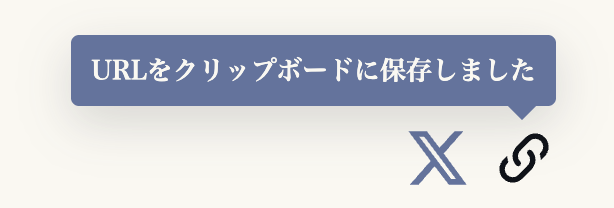

最近、以下のようなポストがありました。

```txt
Popover API がベースラインになりました、JavaScript 不要

HTML 属性だけでツールチップ、ドロップダウン、メニューを実現。

⋅ 任意の要素に popover 属性
⋅ トリガーを接続するための popovertarget
⋅ デフォルトでアクセシブル、ARIA のハック不要
```

https://x.com/MozDevNet/status/2052237028310552698

早速、このブログサイトのURLをコピーするボタンに使ってみました。



## Popover APIで何が変わるのか

Popover APIを使うと、吹き出しや小さなメニューを「ただの非表示要素」ではなく、ブラウザが開閉状態を管理するポップオーバーとして扱えます。

まず、表示したい要素に `popover` 属性を付けます。

```html
<span id="copy-tooltip" popover>コピーしました</span>
```

これでこの要素は、ポップオーバーとして開閉できる要素になります。

次に、開くきっかけになるボタンに `popovertarget` を付けます。

```html
<button type="button" popovertarget="copy-tooltip">URLをコピー</button>

<span id="copy-tooltip" popover> コピーしました </span>
```

`popovertarget` には、開きたいPopover要素の `id` を指定します。

これで「このボタンはこのPopoverを操作する」という関係がHTML上にできます。

JavaScriptであとから要素を探して関係を作るのではなく、HTMLの属性としてUIのつながりを書けるのがいいところです。

## popover属性

`popover` は、要素をPopoverとして扱うための属性です。

今回の吹き出しコンポーネントでは、このように付けています。

```astro
<span id={id} class="tooltip" role="status" aria-live="polite" popover="manual">
	<span>{text}</span>
	<span class="tooltip-arrow" aria-hidden="true"></span>
</span>
```

大事なのは `popover="manual"` です。

この属性を付けることで、要素は「普段は閉じていて、必要なときに開くUI」としてブラウザに扱われます。

`hidden` を付けたり外したりして、表示状態を自分で持つのとは少し考え方が違います。

## autoとmanual

`popover` だけを書くと、`popover="auto"` と同じ扱いになります。

```html
<span popover>自動で閉じるPopover</span>
```

`auto` のPopoverは、外側クリックやEscキーで閉じます。メニューやドロップダウンのように、ユーザーが開いて、必要なくなったら自然に閉じてほしいUIに向いています。

一方で `manual` は、開閉をこちらで制御したいときに使います。

```html
<span popover="manual">手動で閉じるPopover</span>
```

今回の吹き出しは、クリック後に一時的に表示して、少し待ってから自分で閉じます。外側クリックで閉じるUIというより、操作結果を短く知らせるUIです。

なので `popover="manual"` のほうが意図に合います。

## popovertarget属性

Popoverを開くボタンには、`popovertarget` を付けます。

```astro
---
const tooltipId = 'share-copy-tooltip';
---

<button
	type="button"
	aria-label="記事URLをコピー"
	aria-describedby={tooltipId}
	popovertarget={tooltipId}
	data-share-button
>
	<!-- icon -->
</button>

<Tooltip id={tooltipId} text="URLをクリップボードに保存しました" />
```

`popovertarget={tooltipId}` によって、このボタンと `id="share-copy-tooltip"` を持つPopoverがつながります。

`aria-describedby` も同じ `tooltipId` を見ていますが、役割は別です。

`aria-describedby` は支援技術向けの説明の関係です。  
`popovertarget` はPopover APIとしての開閉対象の関係です。

同じIDを使うことで、アクセシビリティ上の関係とPopoverとしての関係が揃います。

Popoverは、それ自体で読み上げを保証するものではありません。今回は「URLをクリップボードに保存しました」という結果を伝えたいので、`role="status"` と `aria-live="polite"` も付けています。

つまり、`popovertarget` はPopoverとしての接続、`aria-describedby` や `role="status"` は支援技術向けの意味づけ、という役割分担です。

## JavaScriptから開閉する

Popover APIはHTML属性だけでも使えますが、JavaScriptから開閉することもできます。

```js
tooltip.showPopover();
tooltip.hidePopover();
```

今回のように「別の処理が終わったあとにPopoverを開きたい」場合は、JSから `showPopover()` を呼ぶのが自然です。

```js
if (!tooltip.matches(':popover-open')) {
	tooltip.showPopover();
}
```

同じことは `togglePopover(true)` でも書けます。

```js
tooltip.togglePopover(true);
```

`true` を渡すと「開く」、`false` を渡すと「閉じる」という指定になります。開く・閉じるを明示したいときはこちらも便利です。

閉じるときは `hidePopover()` を使います。

```js
tooltip.hidePopover();
```

ここで `hidden = false` や `hidden = true` に戻らないのがポイントです。

Popoverとして開いたものは、Popover APIで閉じる。表示状態をDOM属性で直接書き換えるのではなく、ブラウザが持っているPopoverの状態を操作します。

## :popover-open

`:popover-open` は、Popoverが開いているときに一致する擬似クラスです。

JavaScriptからは `matches()` で確認できます。

```js
tooltip.matches(':popover-open');
```

今回の実装では、開いているかどうかの判断に使っています。

```js
if (!tooltip.matches(':popover-open')) {
	tooltip.showPopover();
}

window.setTimeout(() => {
	if (tooltip.matches(':popover-open')) {
		tooltip.hidePopover();
	}
}, 2200);
```

表示中かどうかを自分で変数に持たなくても、Popoverの状態をブラウザに聞けます。

## トップレイヤーに表示される

Popoverは、開くとトップレイヤーに表示されます。

これもPopover APIの大きな特徴です。

普通の要素として吹き出しを作ると、親要素の `overflow` や重なり順の影響を受けることがあります。Popoverとして開くと、ブラウザが前面に出るUIとして扱うので、ページ内の通常の重なり順とは別の層に乗ります。

「一時的に前面へ出るUI」を作るときに、この性質はかなりありがたいです。

## サポートについて

Popover APIはBaseline 2024に入っています。最近のブラウザを前提にできるサイトなら、かなり使いやすくなってきました。

古いブラウザまで見る必要がある場合は、Popover APIが使えない環境でどう振る舞うかだけ決めておくと安心です。たとえば、吹き出しを出さずに処理だけ完了させる、従来の表示切り替えに戻す、などです。

## Popover APIとして見ると

今回の実装をPopover API目線で見ると、下記の流れ。

```txt
hidden属性で隠す要素
↓
popover属性を持つPopover要素

JSで tooltip.hidden = false
↓
tooltip.showPopover()

JSで tooltip.hidden = true
↓
tooltip.hidePopover()

表示中かどうかを自前で管理
↓
:popover-open でブラウザの状態を見る

ボタンと吹き出しの関係がJS依存
↓
popovertargetでHTML上に関係を書く
```

Popover APIを使う価値は、表示・非表示のコードが少し短くなることだけではありません。

**この要素は一時的に前面へ出るUIで、このボタンから操作されるものだ**という意味を、HTMLとブラウザ標準の仕組みに乗せられることが大きいです。
